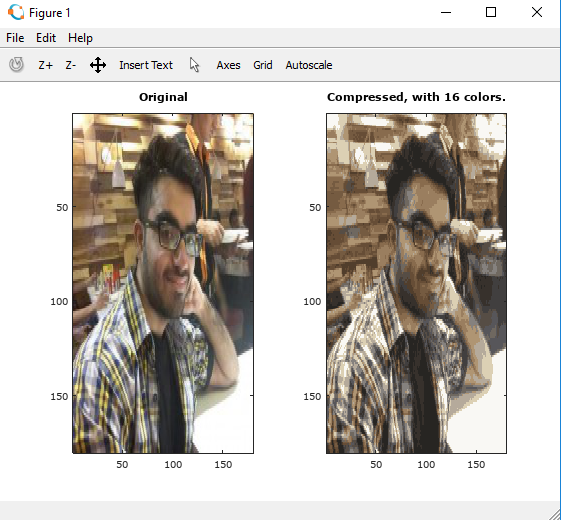

  

# Image Compressor  
  
#### __*A tool to compress image by reducing the number of colors using K-Means Algorithm.*__  
  
  
  
### Description :ledger:    
Image Compressor uses the K-means algorithm for image compression by reducing the number of colors that occur in an image to only those that are most common in that image.  
The K-means algorithm is a method to automatically cluster similar data examples together.  
In a straightforward 24-bit color representation of an image, each pixel is represented as three 8-bit unsigned integers (ranging from 0 to 255) that specify the red, green and blue intensity values.  
An Image contains thousands of colors, and so Image Compressor will reduce the number of colors to 16 colors.  
By making this reduction, it is possible to represent (compress) the photo in an ecient way.  
Specifically, you only need to store the RGB values of the 16 selected colors, and for each pixel in the image you now need to only store the index of the color at that location (where only 4 bits are necessary to represent 16 possibilities).   
  
  
  
### How it works :question:  
Step 1: Copy & Paste your image in project directory. Modify 'compressor' script to read from your image filename.   
Step 2: Run 'compressor' script in your Octave/Matlab command window.  
Step 3: This run 10 iterations, first to train & then outputs the compressed image.   
  
  
  
### Output
  
  
  
  
### Development  
  
Want to contribute? **:pencil:**  
  
To fix a bug or enhance an existing module, follow these steps:  
  
1. Fork the repo
2. Create a new branch (`git checkout -b exciting-stuff`)
3. Make the appropriate changes in the files
4. Add changes to reflect the changes made
5. Commit your changes (`git commit -am 'exciting-stuff!!'`)
6. Push to the branch (`git push origin exciting-stuff`)
7. Create a Pull Request  
  
  
### Interested?  
  
If you find a bug (the website couldn't handle the query and / or gave irrelevant results), kindly open an issue [here](https://github.com/thegenuinegourav/Spilter/issues/new) by including your search query and the expected result.  
  
If you'd like to request a new functionality, feel free to do so by opening an issue [here](https://github.com/thegenuinegourav/Spilter/issues/new) including some sample queries and their corresponding results.  
  
  

### How to Build
* launch Octave/Matlab
* select **Open command window**
* select the project folder
* type 'classifer' on command window  
  
  
### Articles to Learn
* https://www.datascience.com/blog/k-means-clustering
* https://en.wikipedia.org/wiki/K-means_clustering
* https://gist.github.com/obstschale/7320846  
